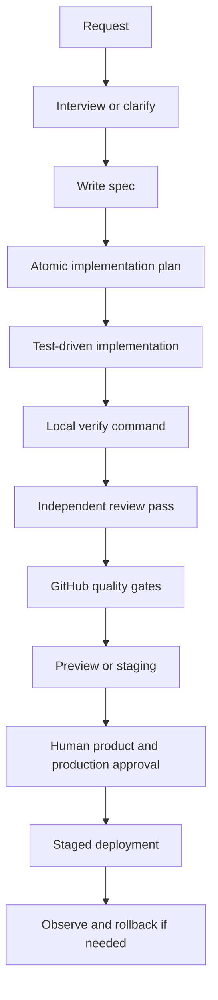

# AI-Only Engineering Workflow

## Standard lifecycle

## Roles

One agent may perform multiple roles sequentially, but it must explicitly switch perspective. For high-risk changes, use separate agent sessions.

- Spec agent: resolves intent and acceptance criteria
- Implementation agent: changes only approved scope
- Test agent: looks for missing and false-positive coverage
- Review agent: correctness, architecture, security, performance, accessibility
- Release agent: verifies gates, prepares deployment and rollback notes

## Task intake

1. Read `AGENTS.md`.
2. Inspect git status and preserve existing work.
3. Read the relevant spec, ADRs, source, tests, and one neighboring pattern.
4. Surface assumptions.
5. Stop on conflicting requirements.

## Definition of Ready

Implementation may start only when:

- User/problem and desired outcome are clear
- Acceptance criteria and non-goals exist
- Security/privacy impact is identified
- Dependencies and rollout constraints are known
- Verification commands are specified

## Definition of Done

- Acceptance criteria are proven by tests or runtime evidence
- `npm run verify` passes after the final change
- No blocking diagnostics, lint errors, skipped tests, or tracked generated artifacts remain
- Docs/spec/ADR are updated
- Security and dependency implications are reviewed
- Diff is scoped and reviewable
- Handoff lists remaining risk honestly

## Autonomy boundaries

Agents proceed autonomously for reversible repository changes. Agents stop for missing product requirements, irreversible operations, production deploys, secret changes, billing, IAM, data deletion, legal/privacy decisions, or conflicting authoritative documents.
