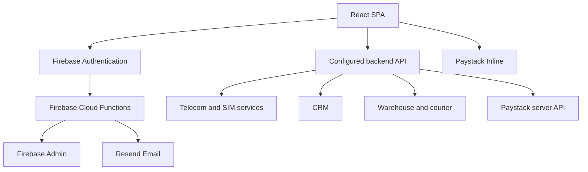

# Limes Architecture

## System overview

Limes is a React 19 single-page application backed by Firebase Authentication, Firebase Cloud Functions, Paystack, and external telecom/CRM/catalog/warehouse APIs.



## Runtime boundaries

### Browser application

- Entry points: `src/main.tsx`, `src/App.tsx`, `src/RootLayout.tsx`
- Routing: React Router in `src/App.tsx`
- Authentication state: Firebase client SDK
- External API access: `src/config/api.ts` and feature services
- Payment popup: Paystack public client; payment verification must happen server-side
- Error tracking: Sentry

### Firebase Functions

- Entry point: `functions/src/index.ts`
- Runtime: Node.js 20
- Responsibilities: auth-triggered email, password reset email, contact inquiry email
- Secrets: Firebase Functions secrets/environment only

### External backend

The frontend service modules are clients, not authorization boundaries. The backend must enforce authentication, resource ownership, validation, rate limits, and payment integrity.

## Module ownership

Feature-specific logic belongs in its owning `src/modules/<domain>/` directory. Cross-domain code belongs in `src/components`, `src/types`, `src/config`, or `src/utils` only when at least two domains genuinely share it.

Dependency direction:

```text
pages/components -> hooks/services/utils -> config/types
functions handlers -> email/config adapters
```

Avoid feature logic in shared utilities and avoid direct API calls from presentation components when an existing service owns the boundary.

## Critical flows

### Authentication

1. Firebase restores client auth state.
2. `useAuthState` blocks route rendering until initialization completes.
3. `AuthenticatedRoute` protects dashboard routes.
4. `ProvisionedUserRoute` redirects users without a provisioned SIM, except approved checkout state.

### Payment

1. Browser requests server-side Paystack initialization.
2. Paystack popup completes the customer interaction.
3. Browser sends the returned reference to the backend for verification.
4. Only verified server responses may trigger subscriber/order/service provisioning.
5. Failures after payment must follow explicit refund/recovery behavior.

### SIM and subscription

Catalog selection, SIM inventory, RICA, payment, subscriber creation, provisioning, and delivery are separate boundaries. Preserve their ordering and idempotency; do not combine them without an approved ADR.

## Architectural rules

- Contracts in `src/types/` should represent validated boundary data; unknown external fields remain `unknown` until narrowed.
- Dates crossing APIs should use explicit ISO formats.
- Currency uses integer cents at payment boundaries.
- MSISDN and ICCID are identifiers, not numbers; keep them as strings.
- Browser environment variables are public by definition and must never contain secrets.
- Cloud Function secrets are read at runtime, not module initialization.

## Expensive decisions

Create an ADR before changing:

- Authentication/session strategy
- Payment initialization or verification flow
- API base contracts
- SIM provisioning sequence
- RICA storage/upload approach
- Hosting/runtime platform
- Cross-module state management
